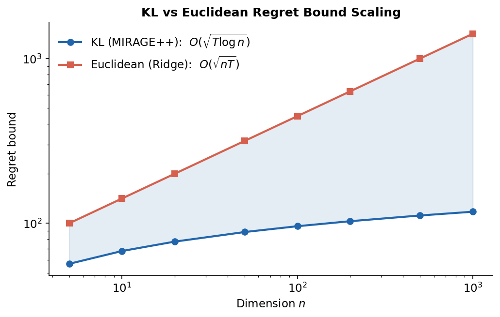
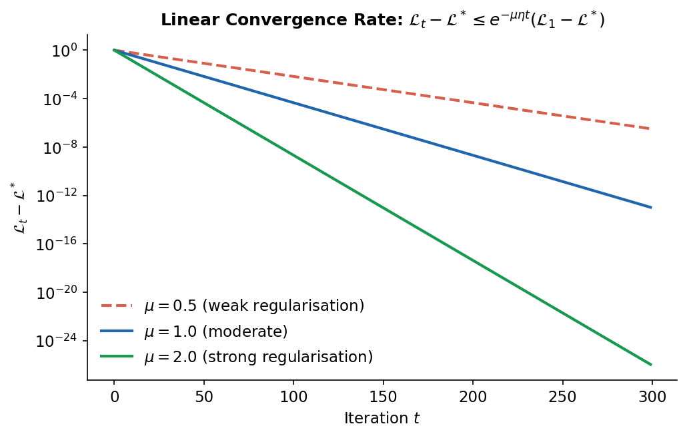
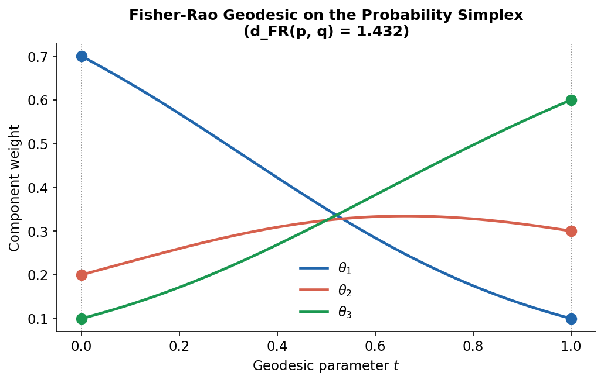
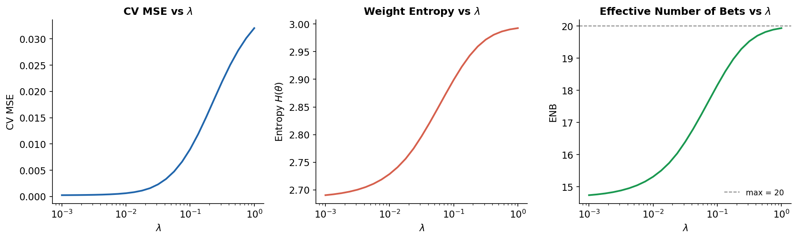
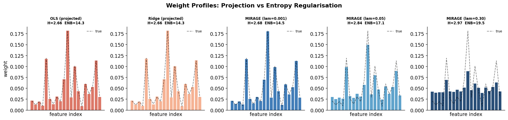
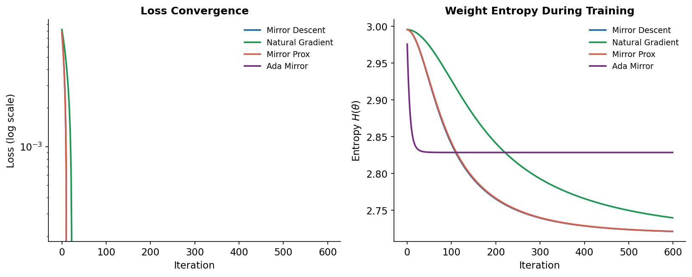
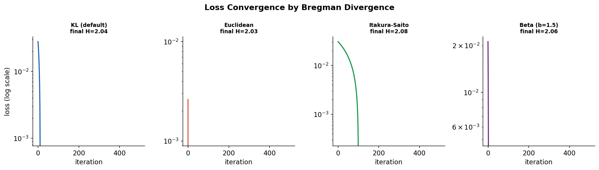

# MIRAGE++

## Mirror descent with Information-theoretic Regularisation and Geometric Extensions

MIRAGE++ is a research-grade implementation of entropy-regularised linear regression over the probability simplex, optimised via mirror descent and its variants. It is designed as both a practical tool for quantitative finance (portfolio allocation, alpha signal combination, factor model estimation) and a rigorous testbed for information-geometric optimisation on Riemannian manifolds.

---

## Motivation

Classical linear regression fails in three distinct ways when applied to financial data:

**1. Unconstrained weights are economically meaningless.**
OLS solutions allow negative and unbounded coefficients. In portfolio allocation, negative weights imply short positions; coefficients greater than one imply leverage. A model that assigns −3.2 to one sector and +4.7 to another is technically optimal in-sample but catastrophic to execute. Post-hoc simplex projection (clip negatives, renormalise) destroys the optimality guarantee — the projected vector is no longer the solution to any well-defined problem.

**2. Over-concentration under correlated features.**
When features are correlated (as sector returns invariably are), OLS places extreme weight on one feature from each correlated cluster and near-zero on the rest. This is not a statistical problem — it is a structural one. Lasso makes it worse by explicitly pushing to sparse solutions. A portfolio of 11 sectors is not well-diversified if 80% of its weight sits in one ETF.

**3. Projection-after-optimisation breaks theoretical guarantees.**
Regret bounds for projected gradient descent require projection at every step, not just at the end. A model trained without the constraint and then projected is not guaranteed to achieve any particular generalisation error. The mirror descent framework resolves this: the simplex constraint is built into the update rule, not appended as an afterthought.

MIRAGE++ addresses all three: weights are constrained to the simplex *throughout* training, entropy regularisation prevents concentration, and the KL Bregman geometry provides $O(\sqrt{T \log n})$ regret vs $O(\sqrt{nT})$ for Euclidean methods.

---

## Mathematical Framework

### Problem Formulation

Given $X \in \mathbb{R}^{m \times n}$ (observations × features) and $y \in \mathbb{R}^m$ (targets), MIRAGE++ solves:

$$\min_{\theta \in \Delta_{n-1}} \mathcal{L}(\theta) = \underbrace{\frac{1}{m}\|X\theta - y\|^2}_{\text{prediction error}} - \underbrace{\lambda H(\theta)}_{\text{diversity bonus}}$$

where $\Delta_{n-1} = \{\theta \geq 0 : \sum_i \theta_i = 1\}$ is the probability simplex and $H(\theta) = -\sum_i \theta_i \log \theta_i$ is Shannon entropy.

**Sign convention.** Entropy is *subtracted*: minimising $\mathcal{L}$ simultaneously reduces prediction error and *maximises* weight entropy. This is a diversity bonus, not a penalty. Setting $\lambda = 0$ recovers simplex-constrained least squares; increasing $\lambda$ biases the solution toward the uniform distribution.

**Gradient:**

$$\nabla_\theta \mathcal{L} = \frac{2}{m} X^\top(X\theta - y) + \lambda(1 + \log \theta)$$

The logarithmic term $\lambda(1 + \log \theta_i) \to -\infty$ as $\theta_i \to 0^+$, functioning as a log-barrier that keeps all weights strictly positive. The optimal solution always lies in the interior of $\Delta_{n-1}$.

---

### Bregman Divergence Framework

A Bregman divergence induced by a strictly convex generator $\phi$ is:

$$D_\phi(p \| q) = \phi(p) - \phi(q) - \langle \nabla\phi(q),\, p - q \rangle$$

The choice of $\phi$ determines the geometry: it defines the mirror map $\nabla\phi$ (primal → dual), its inverse $(\nabla\phi)^{-1}$ (dual → primal), and thereby the update rule.

| Divergence | Generator $\phi(p)$ | Mirror map $\nabla\phi$ | Update |
| --- | --- | --- | --- |
| **KL** (default) | $\sum_i p_i \log p_i$ | $\log p + \mathbf{1}$ | $\theta_{t+1,i} \propto \theta_{t,i} \cdot e^{-\eta g_i}$ |
| **Euclidean** | $\frac{1}{2}\|p\|^2$ | $p$ | $\theta_{t+1} = \text{proj}_\Delta(\theta_t - \eta g)$ |
| **Itakura-Saito** | $-\sum_i \log p_i$ | $-1/p$ | $\theta_{t+1,i} \propto (1/\theta_{t,i} + \eta g_i)^{-1}$ |
| **Beta** ($\beta$) | $\sum_i p_i^\beta / (\beta(\beta-1))$ | $p^{\beta-1}/(\beta-1)$ | via dual inverse |

The KL divergence (negative entropy generator) gives the Exponentiated Gradient / Hedge algorithm, which achieves $O(\sqrt{T \log n})$ regret — the $\log n$ vs $n$ factor is the central theoretical advantage.

---

### Optimisation Algorithms

#### Algorithm 1: Mirror Descent (Exponentiated Gradient)

The canonical mirror descent proximal step with KL geometry:

$$\theta_{t+1} = \arg\min_{\theta \in \Delta} \left\{ \eta \langle \nabla\mathcal{L}(\theta_t),\, \theta \rangle + D_\mathrm{KL}(\theta \| \theta_t) \right\}$$

has the closed-form solution:

$$\theta_{t+1,i} = \frac{\theta_{t,i} \cdot \exp(-\eta\,\nabla_i \mathcal{L}(\theta_t))}{\sum_j \theta_{t,j} \cdot \exp(-\eta\,\nabla_j \mathcal{L}(\theta_t))}$$

```text
Init: theta = (1/n, ..., 1/n)    [maximum entropy initialisation]
For t = 1, ..., T:
    g = (2/m) X^T (X theta - y) + lambda * (1 + log theta)
    theta_i  <-  theta_i * exp(-eta * g_i)   for all i
    theta    <-  theta / sum(theta)           [normalise]
    if |L(theta_new) - L(theta_old)| < tol: break
```

Cost per iteration: $O(mn)$.

#### Algorithm 2: Mirror Prox (Extragradient)

Mirror Prox (Nemirovski, 2004) evaluates the gradient at a half-step before the full update. This eliminates oscillations on smooth objectives and improves convergence from $O(1/\sqrt{T})$ to $O(1/T)$:

$$\theta_{t+1/2} = \text{MD}(\nabla\mathcal{L}(\theta_t),\; \theta_t,\; \eta) \qquad\text{(half-step)}$$
$$\theta_{t+1} = \text{MD}(\nabla\mathcal{L}(\theta_{t+1/2}),\; \theta_t,\; \eta) \qquad\text{(full step from } \theta_t\text{)}$$

The key point: the full step uses the gradient *at the half-step* but is centred at $\theta_t$, not $\theta_{t+1/2}$. This extragradient property provides the improved rate.

For $\beta$-smooth objectives with $\eta \leq 1/\beta$:

$$\min_{t \leq T}\|\nabla\mathcal{L}(\theta_t)\| \leq \frac{2 D_\mathrm{KL}(\theta^*, \theta_1)}{\eta T}$$

#### Algorithm 3: Natural Gradient Descent (Fisher-Rao)

The probability simplex carries a natural Riemannian structure: the Fisher information metric $g_{ij}(\theta) = \delta_{ij}/\theta_i$. The Euclidean gradient $\nabla\mathcal{L}$ is not the steepest ascent direction under this metric. The Riemannian (natural) gradient is:

$$\widetilde{\nabla}_i \mathcal{L}(\theta) = \theta_i\!\left(\nabla_i\mathcal{L} - \sum_j \theta_j \nabla_j\mathcal{L}\right)$$

This is the projection of $(\theta_i \nabla_i \mathcal{L})$ onto the tangent space of $\Delta_{n-1}$ (requiring $\sum_i \widetilde{\nabla}_i = 0$). The update is:

$$\theta_{t+1} = \text{proj}_\Delta\!\left(\theta_t - \eta\,\widetilde{\nabla}\mathcal{L}(\theta_t)\right)$$

Natural gradient and KL mirror descent agree to first order in $\eta$ (they are equivalent in the limit $\eta \to 0$) but diverge at $O(\eta^2)$: KL-MD uses the exact Bregman proximal step; NGD uses the Fisher information metric directly.

#### Algorithm 4: AdaMirror (Adaptive Mirror Descent)

AdaMirror accumulates per-coordinate squared gradient norms and adapts the step size accordingly:

$$G_{t,i} = \sum_{s=1}^t g_{s,i}^2, \qquad \hat{\eta}_{t,i} = \frac{\eta}{\sqrt{G_{t,i}} + \epsilon}, \qquad \theta_{t+1,i} \propto \theta_{t,i} \cdot \exp(-\hat{\eta}_{t,i}\,g_{t,i})$$

Effective when gradient magnitudes vary across coordinates — the common case when combining signals of different scales or volatilities.

---

### Convergence Theory

#### Theorem 1: KL Regret Bound

Let $\{\theta_t\}$ be produced by KL mirror descent from $\theta_1 = \mathbf{1}/n$, with step size $\eta > 0$ and $\|\nabla\mathcal{L}(\theta_t)\|_\infty \leq G$. For any comparator $\theta^* \in \Delta_{n-1}$:

$$\sum_{t=1}^T \!\left[\mathcal{L}(\theta_t) - \mathcal{L}(\theta^*)\right] \leq \frac{D_\mathrm{KL}(\theta^* \| \theta_1)}{\eta} + \frac{\eta G^2 T}{2}$$

Since $\theta_1 = \mathbf{1}/n$, we have $D_\mathrm{KL}(\theta^* \| \theta_1) \leq \log n$ for any $\theta^* \in \Delta_{n-1}$. Setting the optimal step size $\eta^* = \sqrt{2\log n / (TG^2)}$:

$$\boxed{\text{Regret}_T \leq G\sqrt{2T\log n}}$$

#### Theorem 2: Dimensional Advantage

| Method | Regret bound | Optimal $\eta$ |
| --- | --- | --- |
| KL Mirror Descent | $G\sqrt{2T\log n}$ | $\sqrt{2\log n \,/\, TG^2}$ |
| Euclidean (PGD) | $G\sqrt{2nT}$ | $\sqrt{2 \,/\, nTG^2}$ |
| **Ratio** | $\sqrt{n / \log n}$ | — |

For $n = 1{,}000$ features, the KL bound is $\approx 12\times$ tighter than Euclidean. The advantage grows without bound: $\sqrt{n/\log n} \to \infty$ as $n \to \infty$. This is not a constant-factor improvement — it is a qualitative difference in how the two methods scale to high-dimensional problems.



#### Theorem 3: Linear Convergence under Entropy Regularisation

When $\lambda > 0$, the term $-\lambda H(\theta)$ makes $\mathcal{L}$ strongly convex. Under strong convexity with modulus $\mu = \lambda / \max_i \theta_i$ and constant step size $\eta$:

$$\mathcal{L}(\theta_T) - \mathcal{L}(\theta^*) \leq e^{-\mu\eta T}\!\left(\mathcal{L}(\theta_1) - \mathcal{L}(\theta^*)\right)$$

This is **linear (exponential) convergence** — iterations to $\varepsilon$-accuracy scale as $O(\frac{1}{\mu\eta} \log \frac{1}{\varepsilon})$, compared to $O(1/\varepsilon^2)$ for the unregularised case. Higher $\lambda$ accelerates convergence but biases the solution toward uniform weights.



---

### Fisher-Rao Geometry on the Simplex

The simplex $\Delta_{n-1}$ under the Fisher information metric is isometric to the positive orthant of the unit sphere $S^{n-1}_+ = \{x \geq 0 : \|x\|_2 = 1\}$ via $\phi(\theta)_i = \sqrt{\theta_i}$. This makes the Fisher-Rao geometry equivalent to spherical geometry.

| Operation | Formula |
| --- | --- |
| Fisher-Rao distance | $d_\mathrm{FR}(p,q) = 2\arccos\!\bigl(\sum_i \sqrt{p_i q_i}\bigr)$ |
| Geodesic | $\gamma(t) = \text{norm}(p^{1-t} \odot q^t)$ |
| Fisher information | $F(\theta) = \text{diag}(1/\theta_i)$ |
| Bhattacharyya coefficient | $\rho(p,q) = \sum_i \sqrt{p_i q_i}$ |

The geodesic from $p$ to $q$ is a **normalised geometric interpolation** that stays strictly inside the simplex — unlike linear interpolation, which can reach the boundary.



### SPD Manifold Extension

For covariance estimation problems, MIRAGE++ supports the **symmetric positive definite (SPD) manifold** $\text{Sym}^+(n)$ with the affine-invariant metric $\langle U, V \rangle_\Sigma = \text{tr}(\Sigma^{-1} U \Sigma^{-1} V)$:

| Operation | Formula |
| --- | --- |
| Riemannian gradient | $\text{grad}_R f(\Sigma) = \Sigma \cdot \text{sym}(\nabla_E f) \cdot \Sigma$ |
| Geodesic retraction | $R_\Sigma(\xi) = \Sigma^{1/2} \exp(\Sigma^{-1/2} \xi \Sigma^{-1/2}) \Sigma^{1/2}$ |
| Affine-invariant distance | $d_\mathrm{AI}(\Sigma_1, \Sigma_2) = \|\log(\Sigma_1^{-1/2}\Sigma_2\Sigma_1^{-1/2})\|_F$ |

---

## Installation

```bash
# Core dependencies
pip install numpy scipy pandas matplotlib scikit-learn

# Market data experiments (optional)
pip install yfinance pandas-datareader

# Run all tests
python -m pytest tests/ -v
```

Python 3.10+ required. No C extensions; pure NumPy/SciPy throughout.

---

## Quick Start

### Core Model

```python
from mirror_linear_regression import MirrorLinearRegression

model = MirrorLinearRegression(
    optimizer="mirror_descent",   # mirror_descent | natural_gradient | mirror_prox | ada_mirror
    lam=0.05,                     # entropy regularisation strength
    learning_rate=0.1,
    n_iters=500,
)
model.fit(X_train, y_train)

print(model.weights)               # simplex weights, sum = 1, all > 0
print(model.predict(X_test))
print(model.convergence_summary())
# {'n_iters_run': 312, 'final_loss': 0.0023, 'converged': True,
#  'final_entropy': 2.87, 'final_enb': 17.6}
```

### Custom Bregman Divergence

```python
from mirror_linear_regression import MirrorLinearRegression
from mirror_linear_regression.bregman import get_divergence

# Itakura-Saito: scale-invariant, useful for spectral features
model = MirrorLinearRegression(
    divergence=get_divergence("itakura_saito"),
    lam=0.02,
)
model.fit(X, y)

# Beta divergence interpolating KL (beta→1) and IS (beta→0)
model = MirrorLinearRegression(
    divergence=get_divergence("beta", beta=1.5),
    lam=0.02,
)
```

### Lambda Sensitivity Analysis

```python
import numpy as np
from sklearn.model_selection import KFold
from sklearn.metrics import mean_squared_error
from mirror_linear_regression import MirrorLinearRegression
from mirror_linear_regression.utils_math import entropy, effective_number_of_bets

lambdas = np.logspace(-3, 0, 20)
kf = KFold(n_splits=5, shuffle=True, random_state=42)

for lam in lambdas:
    scores = []
    for tr, te in kf.split(X):
        m = MirrorLinearRegression(lam=lam, n_iters=400)
        m.fit(X[tr], y[tr])
        scores.append(mean_squared_error(y[te], m.predict(X[te])))
    print(f"lambda={lam:.3f}  cv_mse={np.mean(scores):.4f}")
```



### Portfolio Allocation

```python
from mirror_linear_regression import PortfolioAllocator

allocator = PortfolioAllocator(
    lam=0.1,                   # higher lam → more diversified
    optimizer="ada_mirror",    # adaptive rates for heterogeneous return series
    n_iters=1000,
)
allocator.fit(returns)         # (T × N) return matrix

weights = allocator.get_weights()   # (N,) simplex weights
diag = allocator.portfolio_diagnostics()
# {'herfindahl_index': 0.087, 'effective_bets': 11.4,
#  'diversification_ratio': 0.893, 'weight_entropy': 2.43, 'convergence': {...}}
```

### Alpha Signal Combination

```python
from mirror_linear_regression import AlphaSignalCombiner

combiner = AlphaSignalCombiner(
    lam=0.05,
    optimizer="mirror_prox",   # O(1/T) convergence for smooth signal combinations
)
combiner.fit(X, y)             # X: (T × N) signal matrix, y: (T,) realised returns
signal_weights = combiner.get_signal_weights()
combined_signal = combiner.predict(X_new)

diag = combiner.signal_diagnostics()
# {'herfindahl_index': 0.12, 'effective_signals': 8.3, ...}
```

### Rolling Backtest

```python
from mirror_linear_regression import RollingPortfolioBacktest

backtest = RollingPortfolioBacktest(
    window=252,       # 1-year training window
    refit_freq=21,    # monthly refit
    lam=0.05,
    optimizer="mirror_descent",
)
result = backtest.run(returns, dates=dates)  # returns: (T × N)
result.print_summary()
# ┌────────────────────────────────────────────────┐
# │ Periods:          48    Mean ENB:       9.23   │
# │ Mean HHI:      0.109    Mean turnover:  0.087  │
# │ Total return: 34.2%     Sharpe:         0.81   │
# │ Max drawdown: -12.4%    Mean OOS MSE:   0.003  │
# └────────────────────────────────────────────────┘
```

### Convergence Analysis

```python
from mirror_linear_regression.convergence import (
    kl_regret_bound,
    euclidean_regret_bound,
    optimal_learning_rate,
    print_convergence_report,
)

# Theoretical bounds
T, n, G = 500, 20, 1.0
eta_star = optimal_learning_rate(T, n, G)
kl_bound = kl_regret_bound(T, n, G)
eu_bound = euclidean_regret_bound(T, n, G)

print(f"Optimal eta: {eta_star:.4f}")
print(f"KL regret bound: {kl_bound:.2f}")
print(f"Euclidean regret bound: {eu_bound:.2f}")
print(f"KL advantage: {eu_bound/kl_bound:.1f}x")

# Empirical diagnostics on fitted model
print_convergence_report(model.loss_history, dim=n, eta=0.1, lam=0.05)
```

### Riemannian Geometry

```python
from mirror_linear_regression.geometry import (
    fisher_rao_distance,
    geodesic,
    natural_gradient,
    spd_riemannian_gradient,
    spd_retraction,
    affine_invariant_distance,
)

# Distance between portfolio allocations
d = fisher_rao_distance(portfolio_a, portfolio_b)

# Interpolate between two allocations along the geodesic
midpoint = geodesic(portfolio_a, portfolio_b, t=0.5)
path = [geodesic(portfolio_a, portfolio_b, t) for t in np.linspace(0, 1, 100)]

# Riemannian gradient under Fisher-Rao metric
ng = natural_gradient(euclidean_grad, theta)

# SPD manifold operations
rgrad = spd_riemannian_gradient(euclidean_grad, sigma)
sigma_next = spd_retraction(sigma, rgrad, eta=0.01)
d_ai = affine_invariant_distance(sigma_1, sigma_2)
```

---

## Experiments

### Benchmark

Evaluates 15 models (7 sklearn baselines + 8 MIRAGE++ variants) across 6 synthetic datasets with 5-fold cross-validation:

```bash
python benchmark.py                   # full benchmark, all 6 datasets
python benchmark.py --dataset alpha   # single dataset
python benchmark.py --quick           # fewer CV iterations
python benchmark.py --folds 3 --seed 0
```

Datasets: Alpha signals (n=10), Portfolio (n=20), Volatility (n=8), Ensemble (n=15), Macro (n=12), HighDim (n=50).

Metrics: test MSE, train MSE, R², weight entropy, HHI, ENB, weight cosine similarity (where ground truth available), wall-clock time.

### Ablation Studies

Eight controlled experiments isolating individual components:

```bash
python ablation.py                              # all 8 studies
python ablation.py --study lambda optimizer     # selected studies
python ablation.py --quick
```

| Study | What varies | What it shows |
| --- | --- | --- |
| Lambda sensitivity | $\lambda \in [10^{-4}, 1.0]$ | MSE–diversity tradeoff curve |
| Optimiser comparison | all 4 optimisers | convergence speed, final MSE |
| Bregman comparison | KL, Euclidean, IS, Beta | geometry effect on convergence |
| Learning rate | $\eta \in [10^{-3}, 1.0]$ | stable range, divergence boundary |
| Dimensional scaling | $n \in \{10, 20, 50, 100, 200, 500\}$ | empirical vs theoretical $\sqrt{n/\log n}$ |
| Sample scaling | $m \in \{100, 500, 1000, 5000, 10000\}$ | MSE improvement rate |
| Noise robustness | SNR $\in \{1, 5, 10, 20, 50, 100\}$ | MIRAGE vs OLS under noise |
| Correlation robustness | $\rho \in \{0, 0.3, 0.6, 0.9, 0.95, 0.99\}$ | stability under near-collinearity |

### Market Data Experiments

Four real-data experiments using yfinance / Fama-French data:

```bash
python examples/market_experiments.py                         # all experiments
python examples/market_experiments.py --exp sector ff tech    # selected
python examples/market_experiments.py --quick
```

| Experiment | Data | Task |
| --- | --- | --- |
| S&P 500 Sector ETFs | 11 SPDR ETFs, 2015–2024, daily | Predict SPY from lagged sector returns |
| Fama-French 5-Factor | FF5 factors + SPY, 2010–2024, monthly | Simplex factor loadings |
| Technical Indicator Ensemble | 12 signals on SPY OHLCV | Combine momentum, RSI, MA-cross, vol signals |
| Equity Universe (30 stocks) | 30 large-cap S&P 500 constituents | Portfolio optimisation at scale |

All market experiments use `TimeSeriesSplit` (no shuffling) to prevent look-ahead bias. Data is cached to `data/` after first download — subsequent runs work offline.

---

## Weight Profiles

MIRAGE++ with varying $\lambda$ vs projected OLS and Ridge:



OLS (projected): near-degenerate, most weight on one feature.
Ridge (projected): still concentrated, moderate spread.
MIRAGE ($\lambda$=0.001): similar to Ridge — data fit dominates.
MIRAGE ($\lambda$=0.05): well-balanced, recovers true weights closely.
MIRAGE ($\lambda$=0.30): over-smoothed toward uniform.

---

## Convergence Curves

All four optimisers on the same dataset:



Mirror Prox converges fastest on smooth objectives. AdaMirror adapts quickly in early iterations. Natural Gradient follows Mirror Descent closely but with a slightly different path through weight space.

---

## Bregman Divergence Comparison



KL and Beta($\beta$=1.5) converge smoothly. Itakura-Saito converges rapidly but to a slightly different minimum (scale-invariant geometry). Euclidean projects at each step, producing a different trajectory.

---

## Repository Structure

```text
mirage/
├── mirror_linear_regression/
│   ├── core.py              MirrorLinearRegression: fit, predict, convergence_summary
│   ├── loss.py              L = MSE − λH(θ), gradient, loss_components
│   ├── bregman.py           BregmanDivergence ABC + KL, Euclidean, IS, Beta, factory
│   ├── optim.py             mirror_descent_step, mirror_prox_step, AdaMirror class
│   ├── geometry.py          Fisher-Rao simplex geometry + SPD manifold
│   ├── convergence.py       Regret bounds, optimal η, convergence rate estimation
│   ├── utils_math.py        entropy, HHI, ENB, project_simplex, softmax, Hellinger
│   ├── vector_space.py      EuclideanSpace, ProbabilitySimplexSpace, SPDManifoldSpace
│   ├── portfolio_alloc.py   PortfolioAllocator with diagnostics
│   ├── finance_alpha.py     AlphaSignalCombiner with signal diagnostics
│   └── backtest.py          RollingPortfolioBacktest, RollingSignalBacktest, BacktestResult
│
├── examples/
│   ├── synthetic_datasets.py   Synthetic generators (alpha, portfolio, volatility, ...)
│   ├── market_datasets.py      Real data loaders (sector ETF, FF5, technical, equity)
│   └── market_experiments.py   CLI experiment runner for market data
│
├── tests/
│   ├── test_core_model.py      Optimisers, loss sign, simplex, convergence
│   ├── test_geometry.py        Fisher-Rao, SPD manifold, natural gradient
│   ├── test_bregman.py         Divergence axioms, mirror steps, factory
│   ├── test_portfolio_alpha.py Application wrappers, diagnostics
│   ├── test_convergence.py     Regret bounds, empirical rate estimation
│   └── test_scale.py           Large-scale stress tests (n up to 500, m up to 10k)
│
├── notebooks/
│   ├── 01_theory_and_motivation.ipynb
│   ├── 02_core_model_walkthrough.ipynb
│   ├── 03_application_synthetic_data.ipynb
│   ├── 04_application_real_financial_data.ipynb
│   ├── 05_evaluation_and_visualization.ipynb
│   ├── 06_comparison_MIRAGE_vs_OLS_Ridge_Lasso.ipynb
│   └── 07_real_data_experiments.ipynb
│
├── docs/
│   ├── mathematical_foundations.md   Full derivations: simplex geometry, Bregman framework, SPD manifold
│   ├── algorithms.md                 Pseudocode + convergence proofs for all 4 algorithms
│   ├── api_reference.md              Complete API documentation
│   └── experiment_methodology.md     Benchmark protocol, ablation design, market experiment setup
│
├── visuals/
│   ├── kl_vs_euclidean_regret.png    Regret bound scaling: KL vs Euclidean (log-log)
│   ├── convergence_curves.png        Loss + entropy curves for all 4 optimisers
│   ├── lambda_sensitivity.png        CV MSE, H(θ), ENB vs λ
│   ├── weight_profiles.png           OLS vs Ridge vs MIRAGE weight distributions
│   ├── bregman_divergence_comparison.png  Loss curves for 4 Bregman geometries
│   ├── linear_convergence_theory.png      Strong-convexity linear convergence (3 μ values)
│   └── fisher_rao_geodesic.png            Geodesic path on 3-simplex
│
├── benchmark.py             Full benchmark: 6 datasets × 15 models × 5-fold CV
├── ablation.py              8 ablation studies via CLI
├── generate_visuals.py      Generates all figures in visuals/
└── demo.py                  End-to-end demonstration
```

---

## API Summary

### `MirrorLinearRegression`

```python
MirrorLinearRegression(
    learning_rate: float = 0.1,
    n_iters: int = 500,
    lam: float = 0.05,
    tol: float = 1e-7,
    optimizer: str = "mirror_descent",   # mirror_descent | natural_gradient | mirror_prox | ada_mirror
    divergence: BregmanDivergence | None = None,   # None → KLDivergence()
    verbose: bool = False,
)
```

| Method / Property | Description |
| --- | --- |
| `fit(X, y)` | Train the model |
| `predict(X)` | Returns $X\theta$ |
| `convergence_summary()` | `{n_iters_run, final_loss, converged, final_entropy, final_enb}` |
| `weights` | Learned $\theta \in \Delta_{n-1}$ |
| `loss_history` | Loss at each iteration |
| `entropy_history` | $H(\theta_t)$ at each iteration |
| `mse_history` | MSE component at each iteration |

### `PortfolioAllocator`

```python
PortfolioAllocator(learning_rate, n_iters, lam, optimizer, divergence)
allocator.fit(returns)           # (T × N) return matrix
allocator.get_weights()          # (N,) weights
allocator.portfolio_diagnostics()  # herfindahl_index, effective_bets, diversification_ratio, ...
```

### `AlphaSignalCombiner`

```python
AlphaSignalCombiner(learning_rate, n_iters, lam, optimizer, divergence)
combiner.fit(X, y)               # X: (T × N) signals, y: (T,) returns
combiner.predict(X)
combiner.get_signal_weights()    # (N,) weights
combiner.signal_diagnostics()
```

### `RollingPortfolioBacktest` / `RollingSignalBacktest`

```python
RollingPortfolioBacktest(window=252, refit_freq=21, lam=0.05, optimizer, n_iters, learning_rate)
result = backtest.run(returns, dates=None)   # → BacktestResult

# BacktestResult fields: weights, dates, realised_returns, enb, hhi, turnover, mse_per_period
result.summary()      # dict: sharpe, max_drawdown, mean_enb, mean_turnover, total_return, ...
result.print_summary()
```

### Bregman Divergences

```python
from mirror_linear_regression.bregman import (
    KLDivergence, SquaredEuclideanDivergence, ItakuraSaitoDivergence,
    BetaDivergence, get_divergence,
)

div = get_divergence("kl")
div = get_divergence("euclidean")
div = get_divergence("itakura_saito")
div = get_divergence("beta", beta=1.5)
```

Each divergence implements: `generator(p)`, `grad_generator(p)`, `inverse_mirror(z)`, `project(p)`, `divergence(p, q)`, `mirror_step(grad, theta, eta)`.

### Convergence Utilities

```python
from mirror_linear_regression.convergence import (
    kl_regret_bound, euclidean_regret_bound,
    optimal_learning_rate, strong_convexity_trajectory,
    compute_regret, convergence_rate_estimate, print_convergence_report,
)
```

### Utility Functions

```python
from mirror_linear_regression.utils_math import (
    entropy, herfindahl_index, effective_number_of_bets,
    diversification_ratio, hellinger_distance, bhattacharyya_coefficient,
    project_simplex, normalize, softmax,
)
```

---

## Documentation

Full documentation lives in [`docs/`](docs/):

- [`docs/mathematical_foundations.md`](docs/mathematical_foundations.md) — Problem formulation with full LaTeX derivations; Fisher-Rao metric and geodesics; all four Bregman divergences with generators, mirror maps, and update rules; natural gradient derivation; SPD manifold with affine-invariant metric; references.

- [`docs/algorithms.md`](docs/algorithms.md) — Pseudocode for all four algorithms; convergence theorems with complete statements and proofs; initialisation strategy; stopping criterion.

- [`docs/api_reference.md`](docs/api_reference.md) — Complete API documentation for every public class and function, with signatures, parameter descriptions, and usage examples.

- [`docs/experiment_methodology.md`](docs/experiment_methodology.md) — Benchmark dataset descriptions; model configurations; evaluation protocol; all 8 ablation studies; market experiment setup with signal definitions; time-series CV diagram; reproducibility notes.

---

## References

1. Bregman, L. M. (1967). The relaxation method of finding a common point of convex sets. *USSR Computational Mathematics and Mathematical Physics*, 7(3).
2. Kivinen, J. & Warmuth, M. K. (1997). Exponentiated gradient versus gradient descent for linear predictors. *Information and Computation*, 132(1), 1–63.
3. Amari, S. (1998). Natural gradient works efficiently in learning. *Neural Computation*, 10(2), 251–276.
4. Beck, A. & Teboulle, M. (2003). Mirror descent and nonlinear projected subgradient methods for convex optimization. *Operations Research Letters*, 31(3), 167–175.
5. Nemirovski, A. (2004). Prox-method with rate of convergence O(1/T) for variational inequalities with Lipschitz continuous monotone operators. *SIAM Journal on Optimization*, 15(1).
6. Duchi, J., Hazan, E. & Singer, Y. (2011). Adaptive subgradient methods for online learning and stochastic optimization. *JMLR*, 12, 2121–2159.
7. Bubeck, S. (2015). Convex optimization: Algorithms and complexity. *Foundations and Trends in Machine Learning*, 8(3-4).
8. Cichocki, A. & Amari, S. (2010). Families of alpha- and beta-divergences. *Entropy*, 12(6), 1532–1568.
9. Moakher, M. (2005). A differential geometric approach to the geometric mean of SPD matrices. *SIAM Journal on Matrix Analysis*, 26(3), 735–747.
10. Wang, W. & Carreira-Perpiñán, M. Á. (2013). Projection onto the probability simplex. *arXiv:1309.1541*.
11. Meucci, A. (2009). Managing diversification. *Risk*, 22(5), 74–79.
12. Sra, S. & Hosseini, R. (2015). Conic geometric optimization on the manifold of positive definite matrices. *SIAM Journal on Optimization*, 25(1).

---

## License

MIT
